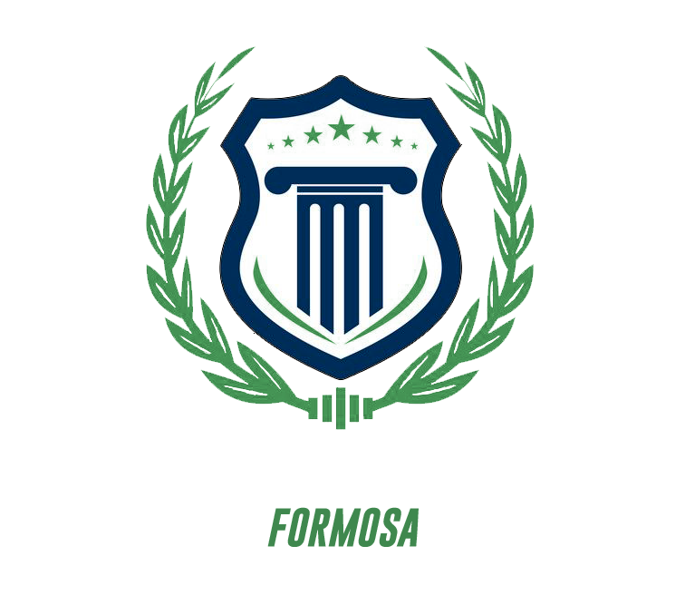
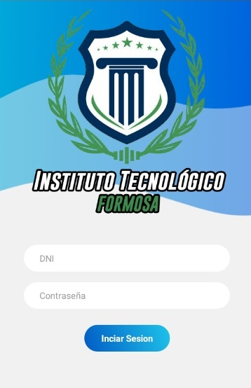
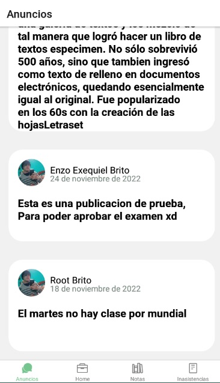
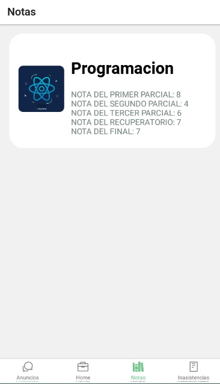
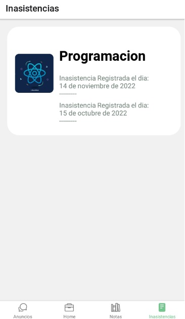

<h1 align="center">
   
  
   
</h1>

<b>BRITO ENZO EXEQUIEL</b>

## **📌Objetivo:**
### Una plataforma web para agilizar los procesos de: manejo de la gestión académica con respecto a las materias, notas (parciales, recuperatorios, finales), asistencias, información documental del alumno requerida por personal docente, avisos Generales. (Para todos los alumnos). Anuncios particulares (por clase).

#

### **🔰 REACT NATIVE**
Usuario para utilizar:

 DNI: 44111222 , Contraseña: 123456

**Es Necesario tener prendido el backend de forma local**

#
### Visualizar el backend aqui: 
📋[BackEnd](https://github.com/EnzoEB12/TP-Instituto-Random "Enlace del backend")

#
### **Caputras De Pantalla**
  

  

  

  

